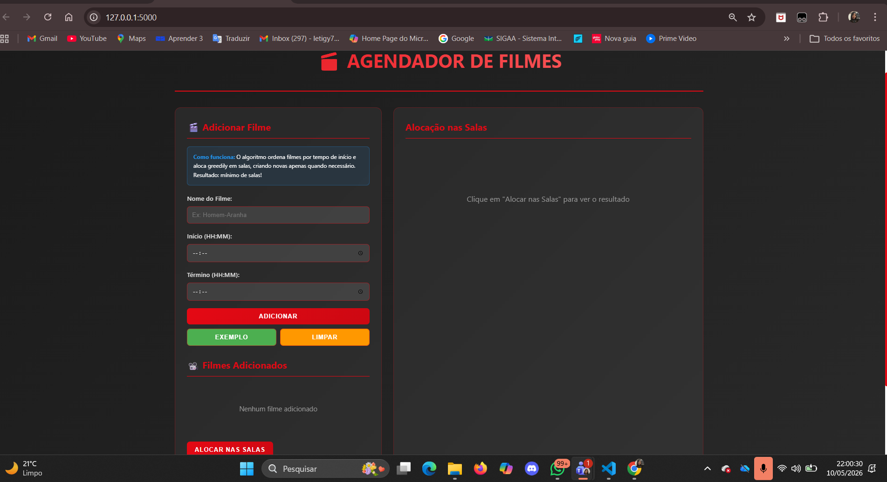
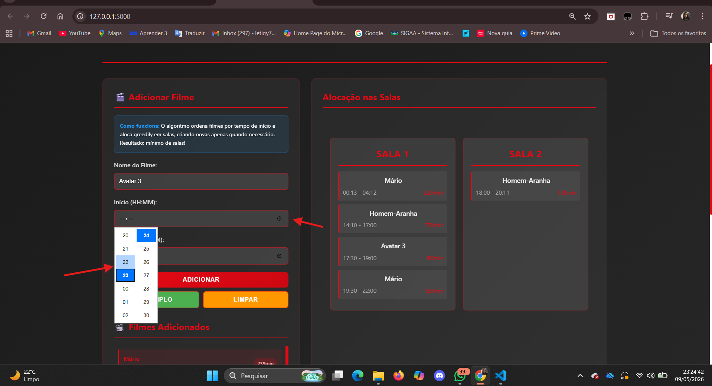
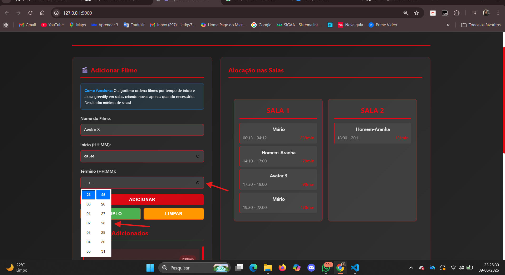
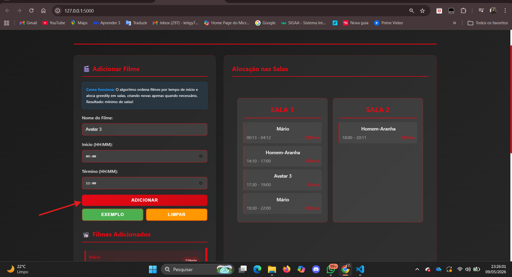
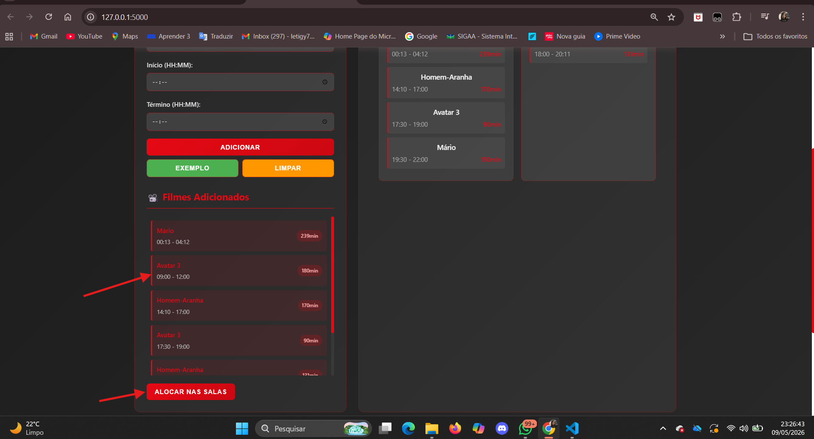
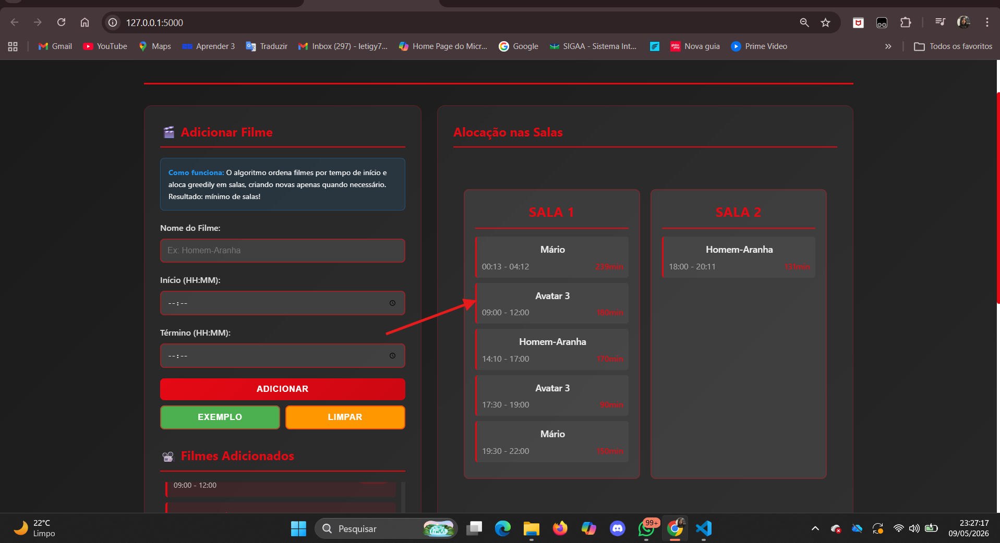
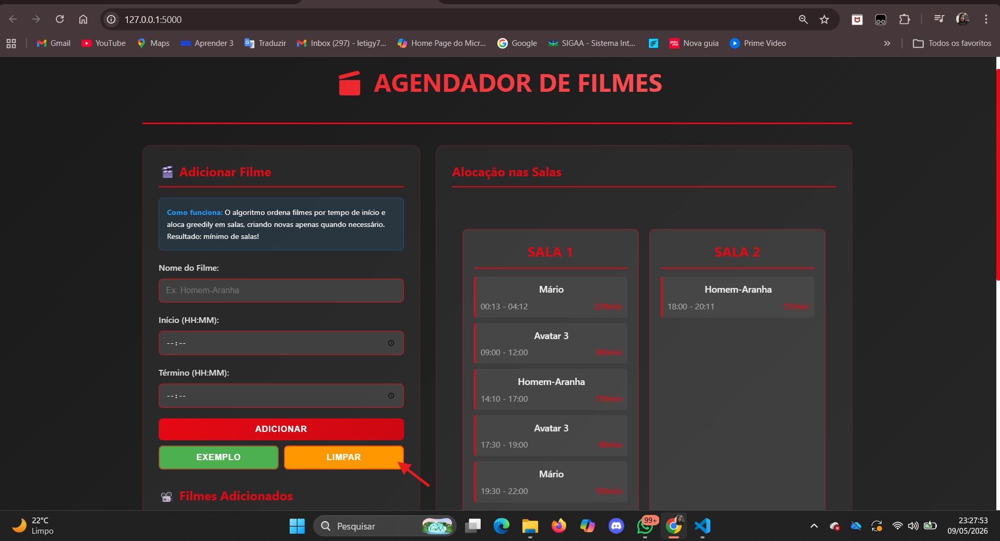
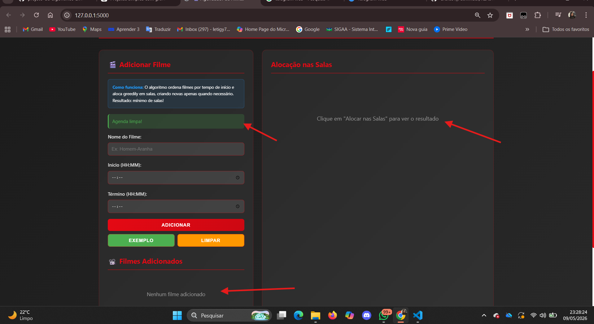

# Agendador de Filmes - Cinema

**Grupo 5**

**Conteúdo da Disciplina**: FGA0124 - PROJETO DE ALGORITMOS - T01 - 2026.1


## Alunos

<div align = "center">
<table>
   <tr>
      <td align="center"><a href="https://github.com/HauedyWS"><br /><sub><b>Hauedy Wegener Soares</b></sub></a><br/></td>
      <td align="center"><a href="https://github.com/LeticiaResende23"><br /><sub><b>Letícia Resende da Silva</b></sub></a><br />
   </tr>
</table>


| Matrícula   | Aluno                             |
| ----------- | ----------------------------------|
| 211030792  | Hauedy Wegener Soares            |
| 211031118  | Letícia Resende da Silva         |
</div>

## Sobre o Projeto

Este projeto é um **Agendador de Filmes para salas de cinema** que usa o algoritmo **Interval Partitioning** (estratégia gulosa) para alocar sessões em salas de forma eficiente, minimizando o número de salas necessárias.

Cada sessão de filme é tratada como um intervalo (início, fim). O algoritmo processa as sessões ordenadas pelo horário de início e reaproveita salas que ficam livres antes do início da próxima sessão; cria novas salas apenas quando necessário.

## Screenshots

<h3>Tela Principal</h3>

<p align="center">
   
</p>

<h3>Indicando hora de início</h3>

<p align="center">
   
</p>

<h3>Indicando hora de Término</h3>

<p align="center">
   
</p>

<h3>Adicionando Filme</h3>

<p align="center">
   
</p>

<h3>Adicionando nas Salas</h3>

<p align="center">
   
</p>

<h3>Alocação nas Salas</h3>

<p align="center">
   
</p>

<h3>Limpando</h3>

<p align="center">
   
</p>

<h3>Agenda Limpa</h3>

<p align="center">
   
</p>


## Como rodar o projeto

- O projeto foi desenvolvido com **Python (Flask)** no backend e **HTML/CSS/JavaScript** no frontend.

#### Instalação

Necessário ter o Python instalado. No Windows você pode usar o `winget` ou baixar do site oficial.

```bash
winget install 9NQ7512CXL7T
python --version
```

#### Clone o repositório
```bash
git clone <seu-repositorio-aqui>
```

#### Abrir o terminal na pasta raiz do projeto

```bash
cd G5_Greedy_PA-26.1
```

#### Instalar dependências

```bash
pip install -r requirements.txt
```

#### Execução do Projeto (servidor local)
```bash
python app.py
```

#### Link para o Navegador
```bash
http://localhost:5000
```

## Apresentação 
[Vídeo de Apresentação](https://www.youtube.com/watch?v=k6tALuryGwI)

***


